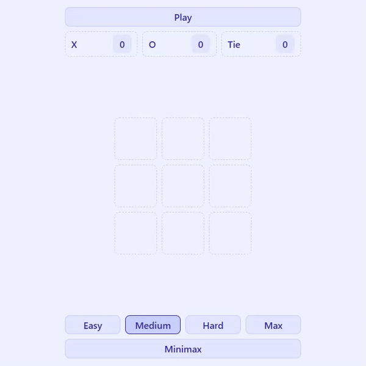

# Tic Tac Toe

This project is a part of [The Odin Project's JavaScript course](https://www.theodinproject.com/paths/full-stack-javascript/courses/javascript).

> [Live Demo](https://lernywensi.github.io/tic-tac-toe)

## Overview

Experience a classic game of Tic Tac Toe in your browser! This simple two-player game allows participants to take turns marking a square in a 3x3 grid with their respective symbols (`X` or `O`). The goal is to be the first to align three of your symbols in a row—horizontally, vertically, or diagonally.

## Game Rules:

-   Players alternate turns.
-   A player wins by placing three of their symbols in a row.
-   If all squares are filled without a winner, the game ends in a tie.

## Minimax Algorithm:

This implementation includes the option to use the minimax algorithm for the `O` player's moves. Players can select from four difficulty levels, each corresponding to a different maximum depth for the minimax algorithm:

-   Easy: `2`
-   Medium: `4`
-   Hard: `6`
-   Max: `Number.MAX_VALUE`

## Technologies Used

-   HTML
-   CSS
-   JavaScript

## Preview | [Live](https://lernywensi.github.io/tic-tac-toe)

